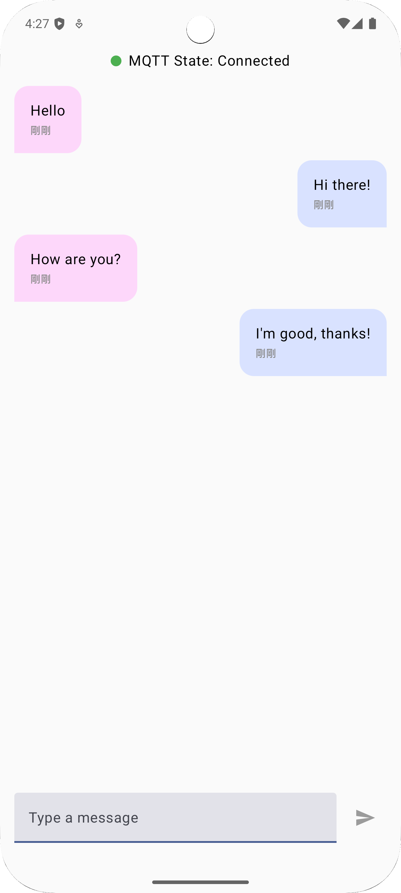

# Android MQTT Chat Compose (Paho + HiveMQ Cloud)

## 專案簡介

本專案是一個 **Android 原生 MQTT 即時聊天示範專案**，使用 **HiveMQ Cloud** 作為 MQTT Broker，並以 **Eclipse Paho MQTT Client** 實作連線，完整展示：

> **Android + Jetpack Compose + Clean Architecture（Presentation / Domain / Data）**  
> **以 Coroutine / Flow / StateFlow 驅動 UI 的即時通訊實作方式**

---

## Demo

| Screenshot           |
|-----------------------------|
|  |
|  |

* Android App 與 **HiveMQ Web Client** 可即時雙向聊天
* 透過 **Topic 分流** 區分訊息來源：
    * `demo/alex/chat/android`：Android 發送
    * `demo/alex/chat/web`：Web / 對方發送
* UI 可正確區分「我送的 / 對方送的」訊息（左右氣泡）

---

## 專案特色

* ✅ 完整 MQTT 連線流程（Connect / Subscribe / Publish）
* ✅ 採用 **Topic-based Sender 設計**（非 payload 判斷）
* ✅ Clean Architecture 分層清楚
* ✅ UI 不直接操作 MQTT Client
* ✅ 使用 **Flow / StateFlow** 驅動 Compose UI
* ✅ 支援 HiveMQ Cloud（TLS / Username / Password）

---

## 使用技術

* Kotlin
* Jetpack Compose（Material 3）
* Hilt Dependency Injection
* Coroutine / Flow / StateFlow
* Eclipse Paho MQTT Client
* HiveMQ Cloud

```kotlin
// --- MQTT (Paho) ---
implementation("org.eclipse.paho:org.eclipse.paho.client.mqttv3:1.2.5")
implementation("org.eclipse.paho:org.eclipse.paho.android.service:1.1.1")
```

---

## 專案架構

```text
com.alex.yang.mqttchatcompose
│
├── data
│   ├── core
│   │   └── MqttConfig.kt
│   │
│   └── repository
│       └── ChatRepositoryImpl.kt
│
├── di
│   └── ChatModule.kt
│
├── domain
│   ├── model
│   │   └── ChatMessage.kt
│   │
│   ├── repository
│   │   └── ChatRepository.kt
│   │
│   └── usecase
│       └── ChatUseCase.kt
│
├── presentation
│   ├── component
│   │   ├── MessageCard.kt
│   │   └── SendMessage.kt
│   │
│   ├── ChatScreen.kt
│   └── ChatViewModel.kt
│
├── utils
│   └── FmtUtil.kt
│
├── App.kt
└── MainActivity.kt

```

---

## 架構設計原則

* **UI（Compose）不直接操作 MQTT Client**
* **ViewModel 只負責狀態與事件，不處理連線細節**
* **Repository 封裝 MQTT 行為**
* **Flow 作為唯一資料流方向**
* **Domain Model 為 UI 的唯一資料來源**

---

## 核心流程說明

### 1️⃣ App 啟動

1. `MainActivity` 啟動
2. `ChatViewModel` 初始化
3. 透過 `ConnectMqttUseCase` 建立 MQTT 連線
4. Subscribe 多個 Topic（android / web）

---

### 2️⃣ 訊息接收（Subscribe）

1. MQTT Client 收到訊息
2. `ChatRepositoryImpl` 將訊息轉換為 `ChatMessage`
3. 根據 **Topic 判斷是否為自己送出（isMine）**
4. 透過 `Flow` 發送至 ViewModel
5. UI 即時更新

---

### 3️⃣ 訊息發送（Publish）

1. 使用者在 UI 輸入訊息
2. ViewModel 呼叫 `PublishMessageUseCase`
3. Repository 發送訊息至：
4. Web / 其他 Client 即時收到

---

## QoS 設計說明

* 本專案使用 **QoS 0**
* 優先考量低延遲與即時互動
* 適合聊天、UI 即時更新場景
* 若需更高可靠性，可升級至 QoS 1 並搭配 Message ID 去重機制

---

## 關於歷史訊息

> MQTT 本身為「即時通訊管道」，**不負責聊天歷史保存**

目前專案：
* 僅顯示連線後的即時訊息

未來可擴充方向：
* Retained Message（最後一筆）
* 後端服務保存聊天紀錄（REST API + MQTT）
* 本地快取（Room）

---

## MQTT Configuration

### local.properties

MQTT 連線相關的敏感設定請放在 `local.properties`：

```properties
SERVER_URI=ssl://<your-hivemq-cluster>.s1.eu.hivemq.cloud:8883
USERNAME=<your-username>
PASSWORD=<your-password>
```

---

## 未來擴充方向

* 🔹 QoS 1 + 訊息去重（messageId）
* 🔹 聊天歷史（Server / Firebase / Supabase）
* 🔹 Retained Message 顯示最後一句
* 🔹 多使用者 / 多 Topic 聊天室
* 🔹 ConnectionState UI 強化

---

## Author

**Alex Yang**  
Senior Android Engineer  
GitHub: https://github.com/m9939418

---

## ⭐ 如果這個專案對你有幫助，歡迎給個 Star
